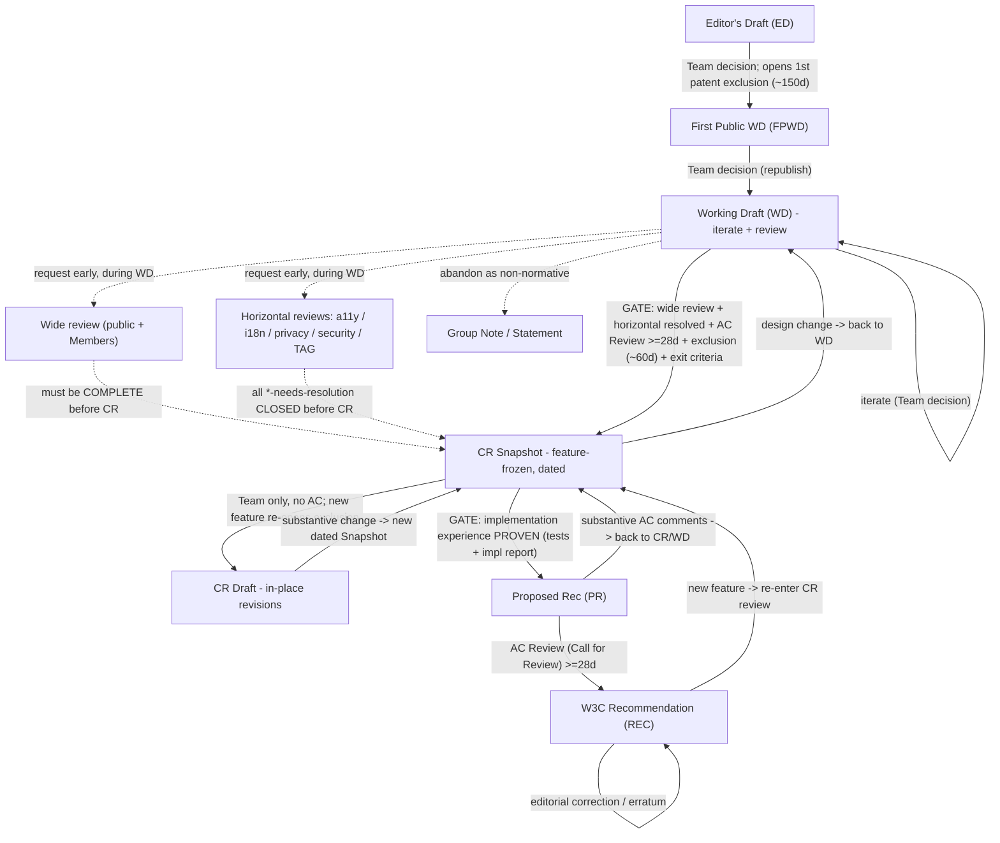
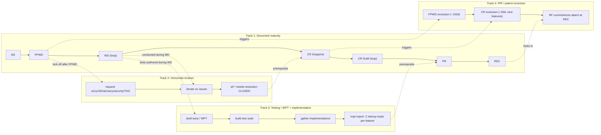

# W3C Recommendation Track — Full Process Flow

Definitive breakdown of the W3C stage machine, for driving a **per-spec progress visualizer** in this dashboard. Current ("Director-free") W3C Process. Companion to `docs/spec-inventory.md` and the co-chair study guide in `~/firefox-bug-investigation/media-wg/co-chair-prep.md`.

**Primary sources**
- Process Document (current): https://www.w3.org/policies/process/
- Rec Track / maturity levels: https://www.w3.org/policies/process/#rec-track
- General transition requirements: https://www.w3.org/policies/process/#transition-reqs
- Candidate Recommendation (Snapshot vs Draft): https://www.w3.org/policies/process/#candidate-rec
- Wide review: https://www.w3.org/policies/process/#wide-review
- Registries: https://www.w3.org/policies/process/#registries
- W3C Council (Director-free): https://www.w3.org/policies/process/#w3c-council
- Horizontal review timing: https://www.w3.org/Guide/documentreview/
- Transition mechanics: https://www.w3.org/guide/transitions/
- Patent Policy exclusion: https://www.w3.org/policies/patent-policy/

> **Director-free note.** The old "Director" approval role is gone. Routine transitions are now **Team decisions** (Team verifies Process requirements are met). The **W3C Council** (AB+TAG) adjudicates **Formal Objections**; the **Advisory Committee (AC)** runs the formal **Reviews (Calls for Review)**. Team verification is withheld if requirements are unmet or an FO is open. Sources: [#w3c-council](https://www.w3.org/policies/process/#w3c-council), [2023 announcement](https://www.w3.org/news/2023/w3c-updates-its-process-document/).

---

## 1. Stage-by-stage table

| Stage | What it is | Entry requirements | Who approves | What it triggers | Loops? |
|---|---|---|---|---|---|
| **ED** — Editor's Draft | Informal editors' copy; no standing. | None (editor/group discretion). | No approval. | Nothing formal — no IPR, no review obligation. | Continuous scratch doc. |
| **FPWD** — First Public WD | First *public* technical report. | Group decision to publish; meets pub-rules; public for comment. | **Team decision.** No AC Review. | **Opens 1st Patent Exclusion Opportunity (~150 days)** — FPWD's UNIQUE trigger. | Entry into the WD loop. |
| **WD** — Working Draft (revised) | Iterative public snapshots; bulk of design + review. | Group decision to republish (≈ every 6 months if changing). | **Team decision.** No AC Review. | No new exclusion by itself. **Window where wide + all 5 horizontal reviews are requested and worked.** | Unlimited iterations — the primary loop. |
| **CR Snapshot** | Stable, dated, feature-frozen CR for implementation + final patent review. | Wide review **complete**; **all horizontal `*-needs-resolution` closed**; substantive comments addressed; exit criteria + at-risk features documented. | **Team decision + AC Review (≥28d)**; Council only if FO. | **Opens 2nd Exclusion Opportunity (~60d, new features).** First stage needing AC review + impl-experience commitment. | Revise via CR Drafts / new Snapshots; may return to WD if design changes. |
| **CR Draft** | Lightweight in-place CR revision *between* Snapshots. | Revision of an existing CR; document changes; keep `*-needs-resolution` closed. | **Team decision only. No AC Review.** | Usually none. **UNIQUE:** a **new feature** in a CR Draft triggers a fresh ~60d Exclusion Opportunity. | The in-CR revision loop; substantive new features force a new Snapshot. |
| **PR** — Proposed Recommendation | Near-final doc sent to Membership for ratification. | **Implementation experience / exit criteria PROVEN** (test suite + impl report, interop); wide review complete; all substantive + horizontal issues resolved. | **Team decision + AC Review (≥28d)**; Council on FO. | The formal Membership ratification review. | AC comments can send it back to CR/WD; minor fixes proceed to REC. |
| **REC** — Recommendation | Final, endorsed standard. | Successful AC Review at PR; **no substantive change vs. reviewed PR**; all comments + FOs resolved. | **Team decision** to publish; Council resolves any FO first. | Locks in **RF licensing commitments**. | Revised via errata + Candidate/Proposed Amendment; new features re-enter CR path. |
| **Note / Statement** | Non-normative deliverable (use cases, guidance, retired specs). | Group/Team decision. | **Team decision** (Statement adds AC notification). | **No exclusion, no RF commitment.** | Freely updatable. |
| **Registry** | Extensible table: *definition* (rules + custodian) + *table* (entries). | Definition meets pub-rules; wide review of the *definition*. **No impl-experience requirement.** | **Team decision.** | Table updates follow the definition's custodian procedure — **no transition, no exclusion per data change.** | Table churns continuously; definition revised normally. |

---

## 2. Are the stage gates identical? **No.** What is UNIQUE at each transition

| Transition | Unique gate (not applied elsewhere) |
|---|---|
| **ED → FPWD** | Triggers **1st Patent Exclusion Opportunity (~150d)**. No review/impl bar — just "go public." |
| **FPWD → WD** | No unique gate — routine Team republish. Wide + horizontal review is *conducted* here (not yet gated). |
| **WD → CR Snapshot** | The heavy gate: **wide review COMPLETE + all 5 horizontal reviews resolved + AC Review (≥28d) + 2nd exclusion (~60d) + documented exit criteria + at-risk features marked.** |
| **CR Snapshot → CR Draft** | **Team-only, no AC Review.** Adding a **new feature** re-opens a patent exclusion for that feature. |
| **CR → PR** | **Implementation experience PROVEN** (tests + impl report, interop). The only transition gated on demonstrated multi-impl interop. |
| **PR → REC** | Only transition gated on a **completed AC Review** + **no substantive change vs. reviewed PR**. Final patent commitments attach. |

**Shared bar (CR/PR/REC):** wide review done, substantive issues formally addressed, group records its decision, Team verifies. [#transition-reqs](https://www.w3.org/policies/process/#transition-reqs)

---

## 3. The 5 horizontal reviews overlaid on the flow

Request **early (during WD, soon after FPWD)**; **resolve all `*-needs-resolution` BEFORE the CR Snapshot.** Turnaround scales with change size — don't assume 2 weeks. [documentreview](https://www.w3.org/Guide/documentreview/)

| Review | Group | Self-review artifact | Request during | Resolved by |
|---|---|---|---|---|
| Accessibility | APA WG | FAST checklist | WD (after FPWD) | Before CR Snapshot |
| Internationalization | i18n WG | i18n self-review checklist | WD (after FPWD) | Before CR Snapshot |
| Privacy | PING | S&P Self-Review Questionnaire (+ RFC 6973) | WD (after FPWD) | Before CR Snapshot |
| Security | Security IG / TAG | S&P Self-Review Questionnaire | WD (after FPWD) | Before CR Snapshot |
| Architecture | TAG | design-review request (Explainer) | WD, well before CR | Before CR Snapshot |

**Rule of thumb: request during WD → resolve before CR.** Horizontal completion is a hard CR prerequisite → it's the critical path for the whole track.

---

## 4. Diagrams

### 4a. Linear stage progression



### 4b. Parallel tracks for a single spec (swimlane-style)



---

## 5. Per-spec checklist data model (seed for the dashboard)

Track these discrete milestones per spec; a weighted sum drives the progress bar. Extends the existing `SpecStatus` model in `src/mediawg_dashboard/model.py`.

```yaml
spec:
  id: string
  title: string
  current_stage: enum[ED, FPWD, WD, CR_SNAPSHOT, CR_DRAFT, PR, REC, NOTE, RETIRED]

  # Maturity milestones (drive the main bar)
  ed_exists: bool
  fpwd_published: bool            # + fpwd_date
  latest_wd_date: date
  cr_snapshot_published: bool     # + cr_snapshot_date
  cr_draft_count: int
  pr_published: bool              # + pr_date
  rec_published: bool             # + rec_date
  on_note_track: bool

  # Wide review
  wide_review_requested: bool
  wide_review_complete: bool

  # Horizontal reviews (each: requested / resolved)
  a11y_review_requested: bool
  a11y_review_resolved: bool
  i18n_review_requested: bool
  i18n_review_resolved: bool
  privacy_review_requested: bool
  privacy_review_resolved: bool
  security_review_requested: bool
  security_review_resolved: bool
  tag_review_requested: bool
  tag_review_resolved: bool
  horizontal_needs_resolution_open: int   # must be 0 to enter CR

  # Testing / implementation (CR->PR gate)
  test_suite_exists: bool
  wpt_coverage_pct: number
  impl_report_ready: bool
  interop_impls_per_feature_met: bool      # >=2 independent impls per feature

  # Approvals / governance
  ac_review_cr_done: bool
  ac_review_pr_done: bool
  formal_objection_open: bool
  council_resolved: bool

  # IPR / patent
  fpwd_exclusion_opened: bool     # ~150 days
  cr_exclusion_opened: bool       # ~60 days (new features)
  exclusion_period_closed: bool

  # Derived gate flags (computed)
  ready_for_cr: bool   # wide_review_complete AND horizontal_needs_resolution_open==0 AND exit criteria documented
  ready_for_pr: bool   # impl_report_ready AND interop_impls_per_feature_met AND substantive issues addressed
  ready_for_rec: bool  # ac_review_pr_done AND no substantive change vs PR AND !formal_objection_open
```

**Suggested progress weighting** (0–100): FPWD 10 · sustained WD + wide-review-requested 20 · all horizontal reviews resolved 25 · CR Snapshot 20 · impl report + interop met 15 · PR 5 · REC 5.

**Gate the bar:** it must not pass the CR segment until `ready_for_cr`, nor the PR segment until `ready_for_pr`. This makes stalled horizontal reviews or a missing implementation report visually obvious — exactly the co-chair's pain point.
</content>
